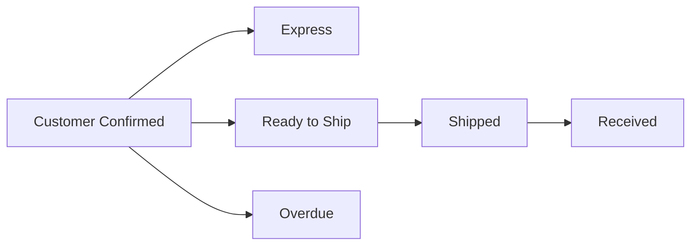

# OCD Crochet - Shopify Order Management Dashboard

[](https://reactjs.org/)
[](https://nodejs.org/)
[](https://tailwindcss.com/)
[](https://shopify.dev/api)

A custom internal dashboard for **OCD Crochet** designed to streamline order tracking and management processes. This dashboard replaces Shopify's default order view with an intuitive, interactive grid layout focused on manual workflows and smart automations.

## ✨ Features

### Order Management

- 📊 Visual grid layout with order cards
- 🔍 Advanced filtering and search capabilities
- 📝 Quick status updates and note management
- 📦 Bulk actions for multiple orders
- ⚡ Express order handling
- ⏰ Automated overdue order detection

### Automation

- 🤖 WhatsApp integration for status updates
- 📱 Shipping API integration
- 📊 Google Sheets synchronization
- 🔄 Automated status transitions

## 🛠️ Tech Stack

### Frontend

- **React** - Modern UI framework
- **TailwindCSS** - Utility-first CSS framework
- **React Query** - Data fetching and caching
- **React Router** - Client-side routing

### Backend

- **Node.js** - Runtime environment
- **Express** - Web framework
- **Firebase Firestore** (optional) - Data persistence
- **Shopify Admin API** - Order management

### Integrations

- **WhatsApp API** (Twilio/360Dialog)
- **Google Sheets API**
- **Shipping APIs** (Aramex, Mylerz, Bosta)

## 📋 Order Status Workflow



## 🚀 Getting Started

### Prerequisites

- Node.js 18.x or higher
- npm or yarn
- Shopify store with admin access
- Private app credentials

### Installation

1. Clone the repository:

```bash
git clone https://github.com/your-org/ocd-crochet-dashboard.git
cd ocd-crochet-dashboard
```

2. Install dependencies:

```bash
# Backend
cd backend
npm install

# Frontend
cd frontend
npm install
```

3. Configure environment variables:

```bash
# Backend .env
SHOPIFY_API_KEY=your_api_key
SHOPIFY_API_SECRET=your_api_secret
SHOPIFY_STORE_URL=your-store.myshopify.com

# Frontend .env
REACT_APP_API_URL=http://localhost:3000
```

4. Start development servers:

```bash
# Backend
cd backend
npm run dev

# Frontend
cd frontend
npm run dev
```

## 🔐 Shopify API Setup

### Required Access Scopes

- `read_orders`
- `write_orders`
- `read_customers`
- `write_customers`
- `read_fulfillments`
- `write_fulfillments`
- `read_tags`
- `write_tags`

### API Configuration

1. Create a private app in Shopify Admin
2. Store the Admin API Access Token securely
3. Configure the base API URL: `https://{shop}.myshopify.com/admin/api/2023-10/`

## 📊 Order Card Features

Each order card displays:

- Customer Name
- Order Number
- Timeline Progress Bar
- Items & Quantities
- Order Notes
- Order Total
- Fulfillment Status
- Action Buttons

## 🔍 Views & Filters

### Predefined Views

- ✅ Confirmed Orders
- 🚚 Ready to Ship
- ⏱️ Overdue Orders
- 🟢 Express Orders
- 📦 Shipped Orders

### Search & Filter Options

- Order Number
- Customer Name
- Phone Number
- Status
- Express Tag
- Date Range

## 🤝 Contributing

1. Fork the repository
2. Create your feature branch (`git checkout -b feature/amazing-feature`)
3. Commit your changes (`git commit -m 'Add some amazing feature'`)
4. Push to the branch (`git push origin feature/amazing-feature`)
5. Open a Pull Request

## 📝 License

This project is licensed under the MIT License - see the [LICENSE](LICENSE) file for details.

## 📞 Support

For support, email support@ocdcrochet.com or create an issue in the repository.
